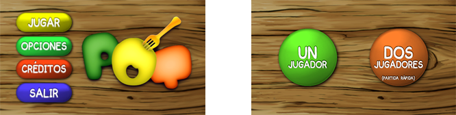
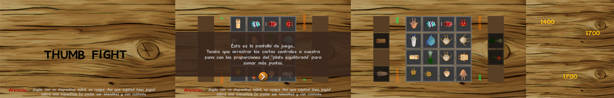
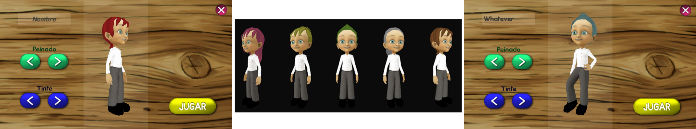
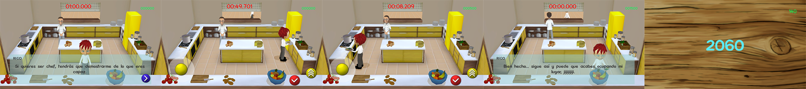
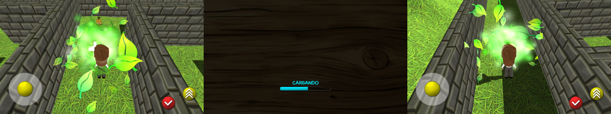
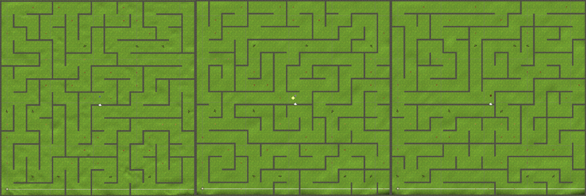

# **POT**

Pot is an Android educational video game in Spanish that teaches childs about the advantages of a healthy and well-balanced diet.

Pot was my final project in my Higher Education, I made concepts, textures, narrative, music edition, UI, game design, 3D modeling, animations and programming. In about three months. This videogame has builded two levels and a third one is in development.

   

This repo contains just the scripts, to know more you can watch a [video](https://www.youtube.com/watch?v=VjLG5JYw0Bc&t=4s) or read the [GDD_2017](gdd2017.pdf), this document is written in Spanish but is planned to be released in English in the future. 

---
## **Presentation**

A cook moves to a town, named Pot to work as a waiter in its prestigious restaurant. This cook will try to become a chef and with this purpose will work in different tasks, from gathering foods to cooking. In this process, player will learn about good habits, the three food groups and the eatwell plate.  

## **The game**

First, we find the main menu where there are four buttons to navigate. Actually credits and options are not working because I am still developping the game and other web projects. If player clicks on Jugar/Play, another screen appears  with two big buttons, to play with a friend or in history mode.

## Thumb Fight

If multiplayer is choosen, players will go to Thumb Fight, where they, locally in one device, will play to a card game (in the video linked before, girl's feedback is from this level). 

Level consists in filling your places simulating the proportions of an eatwell plate. When time is over, a screen shows the scoring of each player, loser score disapears and winner goes to the center.

Actually in multiplayer there is just one game, is planned in the future to have more and access to them with another menu.

## One player

When one player button is clicked, screen changes to personalize the main character, choosing between hairstyles, hair color and name. I made a character without gender, then changing the name or hair can be boy or girl.

When button Jugar is pressed, actually goes to one level (labyrinth in development and kitchen in builded version), but this will go to the own town, then, walking to one place or another loaded level will be different, to know more, you can check at [GDD_2017](gdd2017.pdf).

## Kitchen

In this level, the main task is to provide the chef the ingredients that he needs to cook. For this is needed to take a plate, fill it with the ingredients around the kitchen with the proportions of the eatwell plate and leave it on the worktop. Then the chef take it, "cook it" and put it in the pass for the waiters.

Before playing, the chef will explain everything needed to play the level, and when the time is over, will say something different depending of the punctuation.

This level will be renewed to create more dynamism.

## Protective Labyrinth

As I explained before, this is the level that I'm actually working with, harder part is done but conversations, timer and icon that shows the gathered food are not implemented yet.

This level is the Protective Labyrinth where those foods explain to the player the benefits about nourish with them. Some of the catched vegetables will explain this in-game.

There is a loading bar that really shows the progress of creating the procedural labyrinth and positioning the characters. Labyrinth starts being a grid, then the current position looks at possible ways and destroy the wall in the middle, also checks if the adjacent cells have been visited, current position changes and the bucle continues until all the cells has been visited and the "perfect labyrinth" has been made. 

## **Next updates**

Unfortunately, I have to share my free time working on this and in other projects and here there are a lot of work to do, but anyway, I will finish the labyrinth, then is necessary to fix some bugs, the kitchen and the menus and the GDD, once this is done, I will create the body-building and energetic food levels. Also I will start modeling and creating the scene of the town, to go throught the levels freely. 

I've been created different characters that will be in the town and also in their own levels.

Full idea can be seen in [GDD_2017](gdd2017.pdf)

## **Author**

From concepts to development throught documentation: [MinaZhen](https://github.com/MinaZhen).
